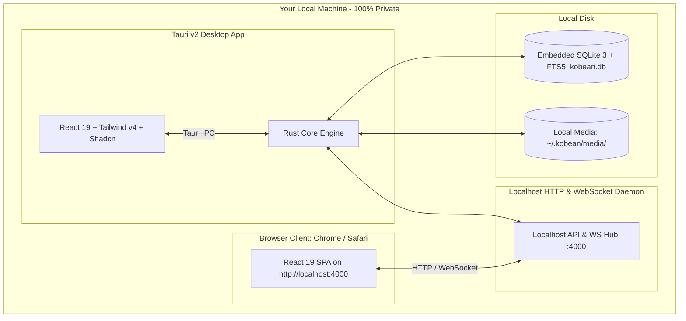

# System Overview & Architecture — KobeanTest

## 1. High-Level Concept

KobeanTest is a 100% localhost-first Test Management System designed for engineers and QA professionals who demand sub-16ms speed, total data privacy, and keyboard-driven efficiency.

## 2. Core Architectural Pillars

### A. Dual Client Interface (Desktop + Web)
- **Tauri v2 Desktop App**: Native OS shell for macOS, Windows, and Linux. Low memory (~35MB RAM), sub-150ms startup, native screen capture hooks, and floating mini-HUD.
- **Localhost Web Client**: Available in any browser at `http://127.0.0.1:4000` via the embedded local daemon, providing full functional parity.

### B. Single Source of Truth: Embedded SQLite with FTS5
- Data is stored in a single file (`kobean.db`) in the user application data directory.
- Full-Text Search (FTS5) using BM25 ranking guarantees `< 5ms` queries across 50,000+ test cases.
- Write-Ahead Logging (WAL) ensures lock-free concurrent reads while tests execute.

### C. Zero-Cloud Guarantee
- Zero external database accounts (no Supabase, no AWS, no Cloudflare required).
- Zero remote telemetry or data tracking.
