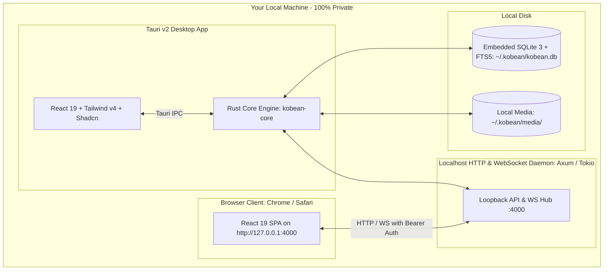

# System Overview & Architecture — KobeanTest

## 1. High-Level Concept

KobeanTest is a 100% localhost-first Test Management System designed for engineers and QA professionals who demand sub-16ms speed, total data privacy, and keyboard-driven efficiency.

## 2. Core Architectural Pillars

### A. Single Rust Core Engine (`kobean-core`)
- Both the desktop application and the local HTTP/WebSocket daemon share a **single Rust domain library**.
- There is zero duplicate logic: database queries, migrations, FTS5 BM25 search ranking, and JUnit parsing are implemented once in Rust.

### B. Client Interfaces & Browser Parity Scope
- **Tauri v2 Desktop Shell**: Native OS app for macOS, Windows, and Linux. Includes hardware screen capture hooks, always-on-top Floating Mini-HUD, and window-scoped hotkeys.
- **Localhost Web Client (`http://127.0.0.1:4000`)**: Full parity for test authoring, suite management, virtualized grid viewing, and live run execution. Native desktop features (floating HUD, background global screen recording) are cleanly detected and disabled with appropriate UI badges.

### C. Security & Loopback Isolation
- Local daemon binds strictly to `127.0.0.1`.
- Authentication via startup session token (`~/.kobean/session.json`).
- Strict validation of `Host` and untrusted `Origin` headers prevents DNS rebinding and cross-site fetch attacks.

### D. Single Source of Truth: Embedded SQLite with FTS5
- All data resides in `~/.kobean/kobean.db`.
- Write-Ahead Logging (WAL) ensures concurrent reads without blocking writers.
- Backups are created atomically via SQLite's Online Backup API (`VACUUM INTO`).
