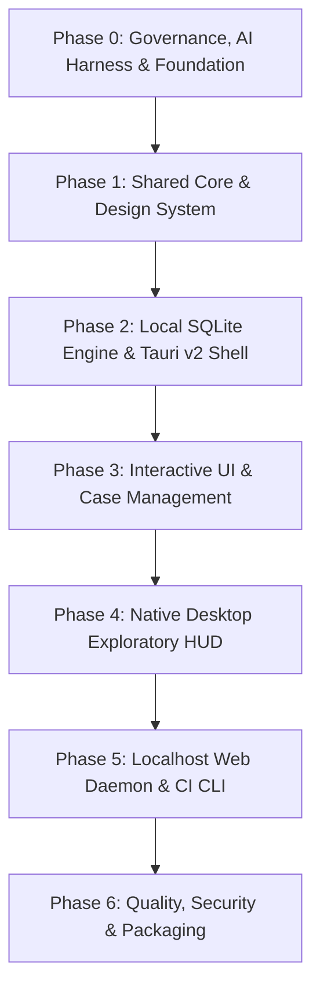

# KobeanTest — Master Implementation Plan

> **Author**: Lead Scrum Master & Principal Product Owner  
> **Project**: KobeanTest (100% Localhost Next-Gen Test Management System)  
> **Target Architecture**: Tauri v2 + Rust + React 19 + SQLite FTS5  
> **Version**: 1.0.0

---

## Executive Summary & Milestones

This document details the complete phased delivery plan for KobeanTest. It breaks the engineering journey into discrete, measurable phases modeled after enterprise Scrum sprints.

---

## Phase 0: Master Governance, AI Harness & Monorepo Foundation
**Theme**: "Zero-Ambiguity Foundations"  
**Goal**: Configure Git repository, AI agent rules, secret scanning, and pro documentation.

### Deliverables:
1. **AI Knowledge Base**:
   - `AGENTS.md` and `CLAUDE.md` entrypoints.
   - `.agents/rules/`: Ponytail minimalism, Superpowers TDD, Taste-Skill UI principles, Rust safety, TypeScript strictness, and security isolation.
   - `.agents/personas/`: CTO Architect, Principal SDET, Security Auditor, UI/UX Designer.
   - `.agents/skills/`: `/new-adr`, `/taste-skill`, `/benchmark-ingest`.
2. **Editor Integrations**:
   - `.cursor/rules/*.mdc`: Scoped rule files for frontend, backend, and Tauri Rust.
   - `.claude/settings.json` and MCP server configurations.
3. **Safety & Task State**:
   - `.betterleaks.toml`: Secret and token scanning rules.
   - `lefthook.yml`: Pre-commit typecheck and secret scans.
   - `.beads/state.json`: Git-backed DAG task memory.
4. **Architecture Documentation**:
   - `docs/architecture/system-overview.md`
   - `docs/architecture/adr/`: ADR-0001 (Tauri v2), ADR-0002 (SQLite FTS5), ADR-0003 (Localhost Daemon).

---

## Phase 1: Shared Core & Linear Design System
**Theme**: "Contracts & Visual Craftsmanship"  
**Goal**: Build strictly-typed data models in `packages/core` and the accessible design system in `packages/ui`.

### Work Packages:
1. **`packages/core` (Data Contracts)**:
   - Zod validation schemas for `TestCase`, `TestSuite`, `TestRun`, `TestExecution`, `Attachment`.
   - Inferred TypeScript types with zero `any`.
   - Semantic status definitions (`passed`, `failed`, `blocked`, `skipped`, `flaky`, `automated`).
2. **`packages/ui` (Design System)**:
   - Tailwind CSS v4 + Radix Primitives / Shadcn UI components.
   - 4 Accessible Themes: Obsidian Dark, Nordic Slate, Clean Paper, Warm Sand (WCAG AAA).
   - Accessible `StatusPill` combining Color + Icon (`lucide-react` 1.75px) + Text label.
   - `CommandPalette` (`Cmd + K`) modal with fuzzy search.
   - `StepEditor`: Notion-style markdown editor with `/step` blocks and DOMPurify sanitization.

---

## Phase 2: Local SQLite FTS5 Engine & Tauri v2 Shell
**Theme**: "Native Performance & Sub-Millisecond Search"  
**Goal**: Build the Rust core desktop shell with embedded SQLite and instant FTS5 search.

### Work Packages:
1. **Tauri v2 Shell Configuration (`apps/desktop/src-tauri`)**:
   - Least-privilege capability permissions in `tauri.conf.json`.
   - Sandboxed webview loading the React frontend.
2. **Embedded SQLite Database (`rusqlite`)**:
   - Write-Ahead Logging (WAL) enabled for non-blocking concurrent reads and writes.
   - Database migrations for `workspaces`, `projects`, `test_suites`, `test_cases`, `test_runs`, `test_executions`.
   - Virtual table `fts5_cases` with Porter stemmer and BM25 ranking.
3. **Type-Safe Rust IPC Commands**:
   - `list_suites`, `create_suite`
   - `list_cases`, `create_case`, `update_case`, `delete_case`
   - `search_cases` (< 5ms query SLA over 50,000 cases)
   - `create_run`, `record_execution`
   - Strict `Result<T, AppError>` error returns (zero `unwrap()` in production).

---

## Phase 3: Interactive UI & Test Case Management
**Theme**: "Linear of Test Management"  
**Goal**: Build the 3-pane interactive interface with virtualized rendering and keyboard-first triage.

### Work Packages:
1. **Suite Tree Explorer (Left Pane)**:
   - Collapsible folder tree with drag-and-drop organization.
   - Real-time test count badges and pass-rate progress indicators.
2. **Virtualized Test Grid (Center Pane)**:
   - `TanStack Virtual` / `Glide Data Grid` handling 50,000+ test cases at 120 FPS.
   - Multi-filtering bar: filter by priority, type, tags, and automation status.
3. **Markdown Inspector & Editor (Right Pane)**:
   - Slide-over panel (no modal popups).
   - Inline editing for preconditions, steps, expected results, and tags.
4. **Keyboard-Driven Execution Mode**:
   - Full-screen distraction-free runner mode.
   - Hotkeys: `J`/`K` (navigate), `P` (pass), `F` (fail), `S` (skip), `Cmd+Enter` (submit & next).
   - Optimistic UI: 0ms perceived execution latency.

---

## Phase 4: Native Desktop Exploratory HUD & Capture
**Theme**: "The Desktop Unfair Advantage"  
**Goal**: Build exploratory manual testing tools that browser sandboxes cannot provide.

### Work Packages:
1. **Always-On-Top Mini-Runner HUD**:
   - Secondary compact floating Tauri window (`always_on_top: true`).
   - Floats above mobile simulators or browser windows during manual exploratory testing.
   - Displays active test step with quick `[P] Pass`, `[F] Fail`, `[S] Skip` controls.
2. **Screen Capture & Annotation Hooks**:
   - One-click screen snapping and 30-second bug recording.
   - Direct clipboard paste (`Cmd + V`) with annotation tools (arrows, red box, password blur).
   - Local media storage in `~/.kobean/media/`.

---

## Phase 5: Localhost Web Server & CI/CD Ingestion CLI
**Theme**: "Universal Access & Automation Ingest"  
**Goal**: Provide local web browser access and high-speed CI/CD batch test ingestion.

### Work Packages:
1. **Embedded Localhost Web Server Daemon**:
   - Runs on `http://127.0.0.1:4000` (loopback only).
   - Serves the compiled React 19 SPA for browser users (Chrome, Safari).
   - WebSocket hub for live multi-tab test run progress synchronization.
2. **High-Throughput CI/CD Ingestion Engine**:
   - `POST /api/v1/ci/ingest` endpoint.
   - Streaming batch parser for:
     - Kobean Batch JSON.
     - Standard JUnit XML.
     - Cucumber JSON (BDD).
   - Auto-Case Provisioning (`auto_create_cases: true`): creates test cases automatically from code.
3. **`@kobean/cli` Runner Utility**:
   - Local test runner wrapper: `npx kobean run --playwright "npx playwright test"`.

---

## Phase 6: Hardening, Security Audit & Multi-OS Packaging
**Theme**: "Production Readiness"  
**Goal**: Comprehensive performance verification, security audits, and multi-platform packaging.

### Work Packages:
1. **SLA Verification**:
   - Desktop cold start `< 200ms`.
   - SQLite FTS5 search latency `< 5ms` across 50,000 cases.
   - Scrolling performance steady at 60–120 FPS.
   - Batch CI ingestion `< 2.0s` for 10,000 results.
2. **Security & Secret Defense**:
   - Zero credentials audit via Betterleaks.
   - Tauri capability allowlist verification.
   - DOMPurify XSS injection fuzz testing on test case steps.
3. **Distribution Packaging**:
   - macOS: Universal `.dmg` (Apple Silicon & Intel) with code signing.
   - Windows: `.msi` and `.exe` installers.
   - Linux: `.AppImage` and `.deb` packages.

---

## Definition of Done (DoD) Checklist

For each phase to be signed off:
* [ ] All acceptance criteria met with automated test coverage.
* [ ] `pnpm typecheck` passes with zero errors across all workspaces.
* [ ] Code adheres strictly to the Ponytail minimalism decision ladder.
* [ ] UI components pass the 7-point Taste-Skill visual audit.
* [ ] Zero leaks detected by `betterleaks scan`.
* [ ] Relevant ADRs documented in `docs/architecture/adr/`.
