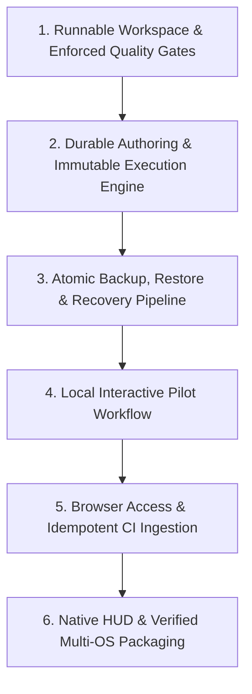

# KobeanTest — Titanium Master Implementation Plan (Hardened)

> **Document Status**: Revised & Hardened  
> **Authors**: Principal Software Architect, Lead Scrum Master, Principal Product Owner, QA Director  
> **Target Architecture**: Tauri v2 + Rust 2021 + React 19 + TypeScript Strict + SQLite 3 FTS5 + Tailwind v4 + Shadcn UI  
> **Classification**: Authoritative Engineering Specification & Execution Contract

---

# Table of Contents
1. [Architectural Master Contracts](#1-architectural-master-contracts)
   - [1.1 SQLite Schema with Immutable History & Strict Domain Invariants](#11-sqlite-schema-with-immutable-history--strict-domain-invariants)
   - [1.2 Rust Tauri IPC & Daemon Architecture](#12-rust-tauri-ipc--daemon-architecture)
   - [1.3 Core TypeScript & Zod Data Models](#13-core-typescript--zod-data-models)
   - [1.4 Localhost Security, Loopback Auth & API Contracts](#14-localhost-security-loopback-auth--api-contracts)
2. [Demonstrable Outcome-Driven Delivery Sequence](#2-demonstrable-outcome-driven-delivery-sequence)
   - [Phase 1: Runnable Workspace & Unforgiving Quality Gates](#phase-1-runnable-workspace--unforgiving-quality-gates)
   - [Phase 2: Durable Authoring & Immutable Execution Engine](#phase-2-durable-authoring--immutable-execution-engine)
   - [Phase 3: Atomic Backup, Restore & Recovery Pipeline](#phase-3-atomic-backup-restore--recovery-pipeline)
   - [Phase 4: Local Interactive Pilot Workflow](#phase-4-local-interactive-pilot-workflow)
   - [Phase 5: Browser Access & Idempotent CI Ingestion](#phase-5-browser-access--idempotent-ci-ingestion)
   - [Phase 6: Native HUD & Verified Multi-OS Packaging](#phase-6-native-hud--verified-multi-os-packaging)
3. [Optimistic UI & Persistence Conflict Contract](#3-optimistic-ui--persistence-conflict-contract)
4. [Quantitative Performance SLAs & Verification Gates](#4-quantitative-performance-slas--verification-gates)

---

# 1. Architectural Master Contracts

## 1.1 SQLite Schema with Immutable History & Strict Domain Invariants

The database lives locally at `~/.kobean/kobean.db`. All connections enforce:
```sql
PRAGMA journal_mode = WAL;
PRAGMA synchronous = NORMAL;
PRAGMA foreign_keys = ON;
PRAGMA busy_timeout = 5000;
```

### Complete DDL Specification
```sql
-- 1. Workspaces
CREATE TABLE IF NOT EXISTS workspaces (
    id TEXT PRIMARY KEY NOT NULL,
    name TEXT NOT NULL,
    slug TEXT UNIQUE NOT NULL,
    created_at INTEGER NOT NULL DEFAULT (strftime('%s', 'now')),
    updated_at INTEGER NOT NULL DEFAULT (strftime('%s', 'now'))
);

-- 2. Projects
CREATE TABLE IF NOT EXISTS projects (
    id TEXT PRIMARY KEY NOT NULL,
    workspace_id TEXT NOT NULL REFERENCES workspaces(id) ON DELETE CASCADE,
    name TEXT NOT NULL,
    key TEXT NOT NULL, -- e.g. "KB" for KB-101
    description TEXT,
    created_at INTEGER NOT NULL DEFAULT (strftime('%s', 'now')),
    updated_at INTEGER NOT NULL DEFAULT (strftime('%s', 'now')),
    UNIQUE(workspace_id, key),
    UNIQUE(id, workspace_id)
);

-- 3. Test Suites (Hierarchy Cycle Guarded)
CREATE TABLE IF NOT EXISTS test_suites (
    id TEXT PRIMARY KEY NOT NULL,
    project_id TEXT NOT NULL REFERENCES projects(id) ON DELETE CASCADE,
    parent_id TEXT REFERENCES test_suites(id) ON DELETE CASCADE,
    title TEXT NOT NULL,
    description TEXT,
    position INTEGER NOT NULL DEFAULT 0,
    created_at INTEGER NOT NULL DEFAULT (strftime('%s', 'now')),
    updated_at INTEGER NOT NULL DEFAULT (strftime('%s', 'now')),
    CHECK(parent_id IS NULL OR parent_id != id),
    UNIQUE(project_id, id),
    UNIQUE(project_id, parent_id, title)
);
CREATE INDEX IF NOT EXISTS idx_suites_project_parent ON test_suites(project_id, parent_id);

-- 4. Test Cases (Mutable Current State)
CREATE TABLE IF NOT EXISTS test_cases (
    id TEXT PRIMARY KEY NOT NULL,
    project_id TEXT NOT NULL,
    suite_id TEXT,
    case_number INTEGER NOT NULL,
    title TEXT NOT NULL,
    preconditions TEXT,
    steps_json TEXT NOT NULL DEFAULT '[]', -- JSON array of Step items
    priority TEXT NOT NULL DEFAULT 'medium' CHECK(priority IN ('low', 'medium', 'high', 'critical')),
    type TEXT NOT NULL DEFAULT 'manual' CHECK(type IN ('manual', 'automated', 'exploratory', 'bdd')),
    automation_id TEXT,
    tags_json TEXT NOT NULL DEFAULT '[]',
    is_flaky INTEGER NOT NULL DEFAULT 0,
    is_archived INTEGER NOT NULL DEFAULT 0, -- Soft-delete / Archival support
    version INTEGER NOT NULL DEFAULT 1,
    created_at INTEGER NOT NULL DEFAULT (strftime('%s', 'now')),
    updated_at INTEGER NOT NULL DEFAULT (strftime('%s', 'now')),
    UNIQUE(project_id, case_number),
    UNIQUE(id, project_id),
    -- Domain Invariant: Case and Suite MUST belong to the exact same Project
    FOREIGN KEY (project_id, suite_id) REFERENCES test_suites(project_id, id) ON DELETE SET NULL,
    FOREIGN KEY (project_id) REFERENCES projects(id) ON DELETE CASCADE
);
CREATE INDEX IF NOT EXISTS idx_cases_suite ON test_cases(project_id, suite_id);
-- Domain Invariant: Unique automation_id per project (ignoring nulls)
CREATE UNIQUE INDEX IF NOT EXISTS idx_cases_project_automation_id 
    ON test_cases(project_id, automation_id) WHERE automation_id IS NOT NULL;

-- 5. Immutable Test Case Revisions (Audit & Historical Integrity)
CREATE TABLE IF NOT EXISTS test_case_revisions (
    id TEXT PRIMARY KEY NOT NULL,
    case_id TEXT NOT NULL,
    project_id TEXT NOT NULL,
    version INTEGER NOT NULL,
    title TEXT NOT NULL,
    preconditions TEXT,
    steps_json TEXT NOT NULL,
    created_by TEXT,
    created_at INTEGER NOT NULL DEFAULT (strftime('%s', 'now')),
    FOREIGN KEY (case_id, project_id) REFERENCES test_cases(id, project_id) ON DELETE CASCADE,
    UNIQUE(case_id, version)
);

-- 6. Full-Text Search Virtual Table (FTS5) - External Content Table
CREATE VIRTUAL TABLE IF NOT EXISTS fts5_cases USING fts5(
    case_id UNINDEXED,
    title,
    preconditions,
    steps_text,
    tags_text,
    tokenize='porter unicode61'
);

-- Triggers for FTS5 Synchronization
CREATE TRIGGER IF NOT EXISTS trg_cases_ai AFTER INSERT ON test_cases BEGIN
    INSERT INTO fts5_cases(case_id, title, preconditions, steps_text, tags_text)
    VALUES (new.id, new.title, coalesce(new.preconditions, ''), new.steps_json, new.tags_json);
    -- Automatically record initial revision
    INSERT INTO test_case_revisions(id, case_id, project_id, version, title, preconditions, steps_json, created_at)
    VALUES (hex(randomblob(16)), new.id, new.project_id, new.version, new.title, new.preconditions, new.steps_json, new.created_at);
END;

CREATE TRIGGER IF NOT EXISTS trg_cases_ad AFTER DELETE ON test_cases BEGIN
    DELETE FROM fts5_cases WHERE case_id = old.id;
END;

CREATE TRIGGER IF NOT EXISTS trg_cases_au AFTER UPDATE ON test_cases BEGIN
    DELETE FROM fts5_cases WHERE case_id = old.id;
    INSERT INTO fts5_cases(case_id, title, preconditions, steps_text, tags_text)
    VALUES (new.id, new.title, coalesce(new.preconditions, ''), new.steps_json, new.tags_json);
    -- Record revision on version bump
    INSERT OR IGNORE INTO test_case_revisions(id, case_id, project_id, version, title, preconditions, steps_json, created_at)
    VALUES (hex(randomblob(16)), new.id, new.project_id, new.version, new.title, new.preconditions, new.steps_json, new.updated_at);
END;

-- 7. Test Runs (Execution Sessions)
CREATE TABLE IF NOT EXISTS test_runs (
    id TEXT PRIMARY KEY NOT NULL,
    project_id TEXT NOT NULL REFERENCES projects(id) ON DELETE CASCADE,
    title TEXT NOT NULL,
    environment TEXT NOT NULL DEFAULT 'local',
    source TEXT NOT NULL DEFAULT 'manual' CHECK(source IN ('manual', 'ci', 'scheduled')),
    status TEXT NOT NULL DEFAULT 'in_progress' CHECK(status IN ('in_progress', 'completed', 'aborted')),
    idempotency_key TEXT UNIQUE, -- Prevents duplicate CI ingestion runs
    commit_sha TEXT,
    branch TEXT,
    total_count INTEGER NOT NULL DEFAULT 0,
    passed_count INTEGER NOT NULL DEFAULT 0,
    failed_count INTEGER NOT NULL DEFAULT 0,
    skipped_count INTEGER NOT NULL DEFAULT 0,
    blocked_count INTEGER NOT NULL DEFAULT 0,
    created_at INTEGER NOT NULL DEFAULT (strftime('%s', 'now')),
    completed_at INTEGER
);

-- 8. Test Run Items (Persisted Membership & Pending State)
CREATE TABLE IF NOT EXISTS test_run_items (
    id TEXT PRIMARY KEY NOT NULL,
    test_run_id TEXT NOT NULL REFERENCES test_runs(id) ON DELETE CASCADE,
    test_case_id TEXT NOT NULL REFERENCES test_cases(id) ON DELETE RESTRICT,
    case_revision_id TEXT NOT NULL REFERENCES test_case_revisions(id) ON DELETE RESTRICT,
    status TEXT NOT NULL DEFAULT 'pending' CHECK(status IN ('pending', 'passed', 'failed', 'blocked', 'skipped')),
    assigned_to TEXT,
    UNIQUE(test_run_id, test_case_id)
);

-- 9. Test Executions (Immutable Execution Attempts / Retries)
CREATE TABLE IF NOT EXISTS test_executions (
    id TEXT PRIMARY KEY NOT NULL,
    run_item_id TEXT NOT NULL REFERENCES test_run_items(id) ON DELETE CASCADE,
    case_revision_id TEXT NOT NULL REFERENCES test_case_revisions(id) ON DELETE RESTRICT,
    attempt_number INTEGER NOT NULL DEFAULT 1,
    status TEXT NOT NULL CHECK(status IN ('passed', 'failed', 'blocked', 'skipped')),
    duration_ms INTEGER NOT NULL DEFAULT 0,
    error_message TEXT,
    stack_trace TEXT,
    notes TEXT,
    executed_by TEXT,
    executed_at INTEGER NOT NULL DEFAULT (strftime('%s', 'now')),
    UNIQUE(run_item_id, attempt_number)
);

-- 10. Step-Level Execution Results
CREATE TABLE IF NOT EXISTS execution_step_results (
    id TEXT PRIMARY KEY NOT NULL,
    execution_id TEXT NOT NULL REFERENCES test_executions(id) ON DELETE CASCADE,
    step_number INTEGER NOT NULL,
    status TEXT NOT NULL CHECK(status IN ('passed', 'failed', 'blocked', 'skipped')),
    actual_result TEXT,
    UNIQUE(execution_id, step_number)
);

-- 11. Execution Attachments (Media & Logs with Step Linkage)
CREATE TABLE IF NOT EXISTS execution_attachments (
    id TEXT PRIMARY KEY NOT NULL,
    execution_id TEXT NOT NULL REFERENCES test_executions(id) ON DELETE CASCADE,
    step_number INTEGER, -- NULL if run-level; populated if step-specific
    file_name TEXT NOT NULL,
    file_path TEXT NOT NULL,
    file_size_bytes INTEGER NOT NULL,
    mime_type TEXT NOT NULL,
    created_at INTEGER NOT NULL DEFAULT (strftime('%s', 'now')),
    FOREIGN KEY(execution_id, step_number) REFERENCES execution_step_results(execution_id, step_number) ON DELETE SET NULL
);
```

---

## 1.2 Rust Tauri IPC & Daemon Architecture

We select a **Single Authoritative Domain Core written in Rust**:
* The desktop application and local web server share the exact same Rust storage and execution engine (`kobean-core` crate).
* **Daemon Lifecycle**:
  - Desktop Mode: Spawns embedded local daemon in a background Tokio task.
  - Headless/CLI Mode: Standalone binary `kobean-daemon` can run without opening a GUI window.
  - On startup, daemon writes live port and secret token to `~/.kobean/session.json`.
  - On exit, flushes SQLite WAL checkpoint cleanly.

---

## 1.3 Localhost Security, Loopback Auth & API Contracts

### Origin & Token Security
1. **Loopback Token Bootstrapping**:
   - On startup, the Rust core generates a cryptographically random 32-byte session token written to `~/.kobean/session.json` with OS file permissions `0600`.
   - All HTTP and WebSocket requests must pass header: `Authorization: Bearer <token>`.
2. **Host & Origin Validation**:
   - Requests with missing or untrusted `Origin` headers (e.g. from malicious web pages) are rejected with `403 Forbidden`.
   - Permitted `Host` headers: `127.0.0.1:*` and `localhost:*`.
3. **Request Size Limits**:
   - JSON payloads bounded to `10 MB`.
   - Multipart batch reports bounded to `100 MB`.

---

# 2. Demonstrable Outcome-Driven Delivery Sequence



### 1. Deliverable 1: Runnable Workspace & Enforced Checks
- **Outcome**: A clean monorepo where deliberately failing secret scans, typechecks, and Clippy linter warnings (`clippy::unwrap_used`) **actively block integration**.
- **Evidence**: `pnpm typecheck`, `betterleaks scan`, and `cargo clippy -- -D clippy::unwrap_used` fail when injected with bad code and pass cleanly on baseline.

### 2. Deliverable 2: Durable Authoring & Immutable Execution
- **Outcome**: Full DDL implemented with strict invariants. Test cases can be created, updated, and executed.
- **Evidence**: Deleting a test case or updating its steps leaves existing historical test runs and executions **100% intact and uncorrupted**.

### 3. Deliverable 3: Backup, Restore & Recovery Pipeline
- **Outcome**: Point-in-time database snapshot via SQLite Backup API (`VACUUM INTO`) and atomic media packaging.
- **Evidence**: Backup created while writes are actively committing under WAL mode restores cleanly with zero data loss.

### 4. Deliverable 4: Local Pilot Workflow
- **Outcome**: Interactive 3-pane UI with virtualized list (50k cases), Notion-style step editor, and 4 verified WCAG AAA themes.
- **Evidence**: User organizes cases, executes manual test run with window-scoped hotkeys (`P`, `F`, `S`), and inspects results without DOM lag.

### 5. Deliverable 5: Browser Access & Idempotent CI Ingestion
- **Outcome**: Local daemon on `http://127.0.0.1:4000` with token auth, Host validation, and streaming JUnit/JSON ingestion with idempotency.
- **Evidence**: Retrying a 10,000-case CI import does not duplicate records; partial XML failures return explicit diagnostic reports.

### 6. Deliverable 6: Native HUD & Verified Multi-OS Packaging
- **Outcome**: Floating mini-HUD window with isolated Tauri capabilities, screen snapping hooks, and cross-platform installers.
- **Evidence**: Installers verified on macOS (`.dmg`), Windows (`.msi`), and Linux (`.AppImage`).

---

# 3. Optimistic UI & Persistence Conflict Contract

To ensure that a green status badge in the UI never lies:

1. **Three-State Mutation Lifecycle**:
   - `optimistic_pending`: State updates immediately in React (0ms). Badge renders with a subtle pulsing indicator.
   - `persisted`: Confirmation received from SQLite via IPC/WebSocket within ~2ms. Pulse ceases.
   - `failed`: Write failed or timed out. UI automatically rolls back status, displays an error toast with a `"Retry Write"` action, and logs failure to client diagnostic log.
2. **Autosave Debounce & Draft Recovery**:
   - Keystrokes write instantly to local in-memory draft cache (`sessionStorage`).
   - Debounce flush to SQLite occurs at 500ms.
   - If user attempts to close the window during debounce, `beforeunload` (web) or Tauri window close event intercepts, flushes pending draft to SQLite, and closes cleanly.

---

# 4. Quantitative Performance SLAs & Verification Gates

| Interaction | Quantitative SLA Threshold | Automated Verification Command |
| :--- | :--- | :--- |
| **Desktop Launch Time** | `< 200 ms` | `cargo bench --bench cold_start` |
| **FTS5 Search Query (50k cases)** | `< 5.0 ms` (p95) | `cargo test --bench bench_fts5_search` |
| **Input Feedback Latency** | `< 8.3 ms` (120 Hz frame budget) | Chrome Performance Timeline Trace |
| **Batch Ingestion (10k cases)** | `< 2,000 ms` | `pnpm benchmark:ingest` |
| **Idle Memory Usage** | `< 45 MB RAM` | OS process memory sampler |
| **Scrolling Performance** | `60–120 FPS` (0 dropped frames) | TanStack Virtual memory and frame audit |
